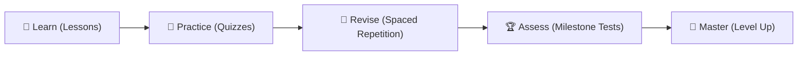

# English Master Pro — Product Design & User Engagement Analysis

This analysis details the visual aesthetics, UX mechanics, pedagogical concepts, and user engagement loops that define **English Master Pro**.

---

## 🎨 1. Graphic Design & Visual System (UI/UX)

The user interface of English Master Pro is designed to look premium, modern, and high-tech, departing from generic "classroom-style" educational apps.

### 🌌 Glassmorphism & Depth
*   **Frosted Glass Accents**: Cards, inputs, and overlays utilize frosted-glass styling (`backdrop-filter: blur(12px)` combined with semi-transparent card backgrounds). This creates a sense of depth and focus.
*   **Contextual Color Borders**: Learning modules are visually separated by distinct neon borders:
    *   `#6c63ff` (Royal Purple) for grammar theory.
    *   `#ff6584` (Sunset Pink) for tenses.
    *   `#43e97b` (Emerald Green) for vocabulary.
    *   `#ffd166` (Amber Yellow) for reading.

### 🌊 Dynamic Motion & Micro-Animations
*   **Interactive Particle Background**: A custom `HTML5 Canvas` particle system draws connected constellation lines in the background. It feels alive and responsive without distracting the learner.
*   **Sleek Transitions**: All pages, cards, and modal windows slide up smoothly (`0.4s cubic-bezier(0.4, 0, 0.2, 1)`) with fading scale effects.
*   **Hover Lift Interactions**: Interactive buttons and cards lift up (`transform: translateY(-4px)`) and emit subtle outer glows on hover, inviting the user to tap them.

---

## 🧠 2. Core Educational Concept
The app is built around a progressive learning lifecycle:

1.  **Learn**: Guided text-to-speech lessons introduce grammar patterns and phonic pronunciations.
2.  **Practice**: Low-stakes micro-quizzes immediately reinforce the lesson.
3.  **Revise**: Leitner-scheduled vocabulary flashcards return systematically to test long-term retention.
4.  **Assess**: Comprehensive Milestone Tests (25Q–200Q) measure readiness for advanced levels.
5.  **Master**: Accumulating experience points unlocks higher proficiency ranks (Beginner to Master).

---

## ⚡ 3. User Engagement & Gamification Loops
English Master Pro implements three primary categories of user engagement triggers: **Immediate Feedback**, **Daily Habits**, and **Long-term Achievement**.

### 🌟 Immediate Feedback Loop
*   **Floating XP Numbers**: Correct answers emit a temporary floating yellow XP indicator near the navbar badge (`+10 XP`). This visual confirmation triggers a dopamine reward system.
*   **Quiz Confetti**: Earning $\ge 80\%$ on a quiz triggers a colorful cascade of confetti pieces falling down the screen.
*   **Answer Explanations**: Instant grading is accompanied by a short textual explanation. E.g. *"London is a specific city name, hence a proper noun."*

### 🔥 Daily Habit Loop (Retention)
*   **Streak Counter**: A flaming streak badge (`🔥`) on the top navigation bar counts consecutive days active. This creates a psychological urge to log in daily.
*   **Daily Goal Progress Strip**: Located at the top of the dashboard, this progress bar visualizes how close the user is to their 10-question daily target. Seeing it progress from `0%` to `100%` encourages the user to finish "just one more quiz."

### 🏆 Long-Term Milestones
*   **Leveling System**: Experience points feed into a circular progress ring around the user's avatar. Ranks progress from *Level 1 (Beginner)* up to *Level 8 (Master)*.
*   **Badge Shelf**: 12 custom achievements (e.g., *Fast Learner*, *Perfect Score*, *Polyglot*) are locked on the shelf. Unlocking one displays a sliding toast notification immediately.

---

## 🎮 4. High-Engagement Mini-Games

The app replaces dry textbook worksheets with interactive game loops:

### 🧩 AI Sentence Builder
*   **The Mechanic**: Words are shuffled into a word bank. The learner must click them in the correct sequence to build a target sentence.
*   **Engagement Factor**: Highly tactile. Wrong configurations trigger a physical shake animation (`animate-shake`) on the answer box, while correct answers award `+20 XP` and trigger successful sound waves.

### ⚡ Speed Challenge
*   **The Mechanic**: A rapid-fire 60-second quiz with a circular SVG timer ring.
*   **Engagement Factor**: High pressure and high reward. Answering correctly builds a **Combo Multiplier** (`2x`, `3x`, etc.), which adds scoring bonuses. Earning 200 points triggers a legendary celebration!

### 🧠 Spaced Repetition (Smart Review)
*   **The Mechanic**: A digital Leitner box vocabulary review card. The user reads a word, tries to recall it, reveals the back, and grades themselves (*"Got it wrong"* or *"Got it right"*).
*   **Engagement Factor**: Gives the user a sense of agency. The presence of countdown timers for upcoming reviews encourages users to stay logged in or check back later.

---

## 🛠️ 5. PWA Mobile Hosting Challenges (iOS & Android)

During the deployment of English Master Pro on mobile devices (via GitHub Pages), we encountered two classic PWA deployment obstacles that initially caused a **404 page error** during installation:

### 1. The Subfolder Asset Path Obstacle
*   **The Problem**: PWAs are designed to run from the root of a domain by default. Our original PWA configuration (`manifest.json` start URLs, registrations, and `sw.js` cache tables) declared absolute path references (e.g. `/` or `/index.html`). 
*   **The Mobile Impact**: When hosted on a subfolder like `https://vikram512700.github.io/English_Grammer_For-_ALL/`, absolute links pointed to the root domain (`https://vikram512700.github.io/index.html`), resulting in 404 resource errors. This blocked browser caching and PWA installation.
*   **The Solution**: We refactored all PWA asset tables and service worker registrations to use **relative paths** (`./` and `'sw.js'`), allowing the app to resolve relative to its current subpath.

### 2. Root-Scoped Service Worker Hijacking
*   **The Problem**: Prior visits registered a service worker at the root domain scope (`https://vikram512700.github.io/`). Even after updating files, the browser persistently queried the root worker, hijacking resource requests and serving cached 404 pages.
*   **The Mobile Impact**: Mobile browsers caching the root-level worker were trapped on a 404 loop and could not receive updates.
*   **The Solution**: We integrated an automatic cleanup script in `js/sw-register.js` that programmatically scans for active root-scoped service workers when hosted in a subfolder, forcefully unregisters them (`reg.unregister()`), and registers the local subpath worker instead. This cleared conflicts in the background without forcing the user to manually reset their phone browser settings.
